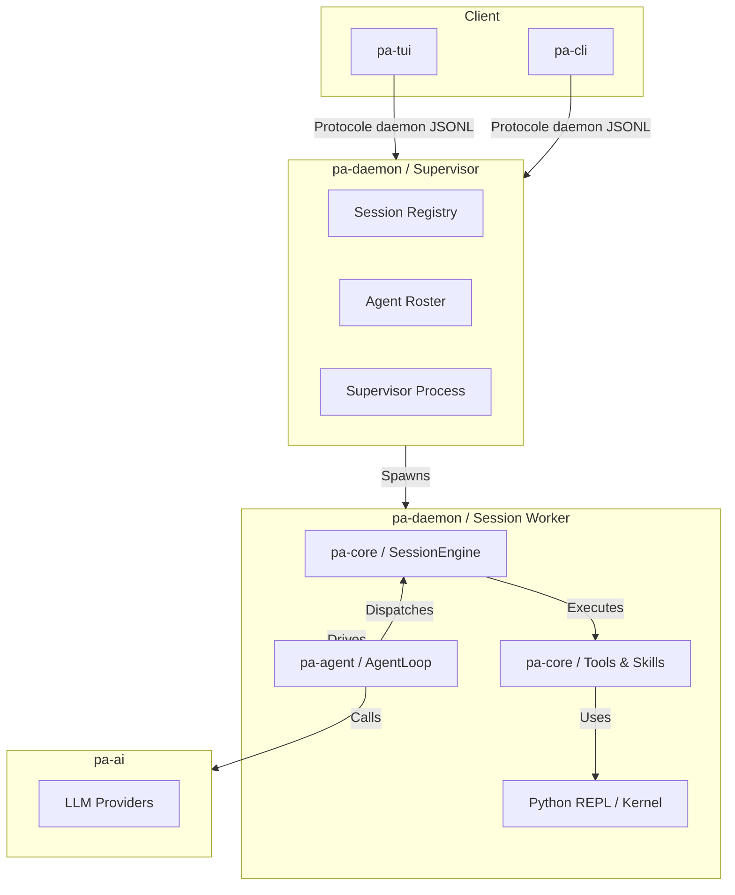
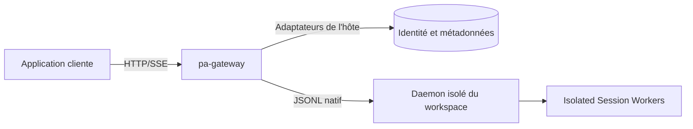

# Prime Agent - Architecture & Guide Gateway

Ce document décrit l'architecture de Prime Agent (Rust) et explore la faisabilité de `pa-gateway`.

## 1. Architecture Globale (Mermaid)

## 2. Rôle des Crates principales

| Crate | Rôle |
| :--- | :--- |
| `pa-agent` | **Boucle de l'agent**. Gère le flux (stream) LLM, l'exécution des outils, les interruptions et le séquençage. Elle est agnostique des outils. |
| `pa-core` | **Moteur de session**. Implémente les outils, les "skills", la gestion du noyau Python, et la persistance des messages/sessions. |
| `pa-daemon` | **Superviseur**. Gère les workers, le protocole local JSONL, la messagerie et le roster. Fournit aussi une interface ACP JSON-RPC distincte sur stdio. |
| `pa-gateway` | **Bibliothèque intégrable**. Gère l'accès multi-utilisateur et les sessions partagées ; routeur HTTP optionnel, identité et stockage fournis par l'application hôte. |
| `pa-ai` | **Abstraction LLM**. Gère les connecteurs vers les différents modèles (Prime Inference, etc.). |
| `pa-types` | **Types partagés**. Définitions des messages, commandes, et protocoles de transport. |

## 3. Analyse de `pa-gateway`

L'objectif est de fournir une brique que d'autres développeurs intègrent dans leur propre application agentique.

### Faisabilité
C'est **tout à fait possible** et même encouragé par la séparation claire entre le superviseur (`pa-daemon`) et la logique de l'agent (`pa-agent`/`pa-core`).

### Points clés pour `pa-gateway` :
1. **Transport** : API HTTP optionnelle et SSE au-dessus du protocole natif daemon JSONL. ACP reste distinct.
2. **Collaboration** : Relation plusieurs utilisateurs ↔ plusieurs sessions, avec rôles et vérification systématique des droits tenant/workspace/session.
3. **Persistance** : Métadonnées via `SessionStore`, historique conservé par le runtime. L'adaptateur mémoire est réservé au développement ; le stockage durable vient de l'hôte.
4. **Isolation** : Le projet hôte provisionne des environnements isolés par frontière de confiance. Un worker par session et une ACL HTTP ne constituent pas une sandbox.

### Architecture Gateway suggérée :

## 4. Recommandation
La crate `pa-gateway` dépend de `pa-types` et `pa-telemetry` uniquement dans le workspace. Elle communique avec le daemon par son protocole, sans lier son implémentation. Voir [le plan](Gateway_Plan.md) et [le contrat d'intégration](crates/pa-gateway/README.md).
